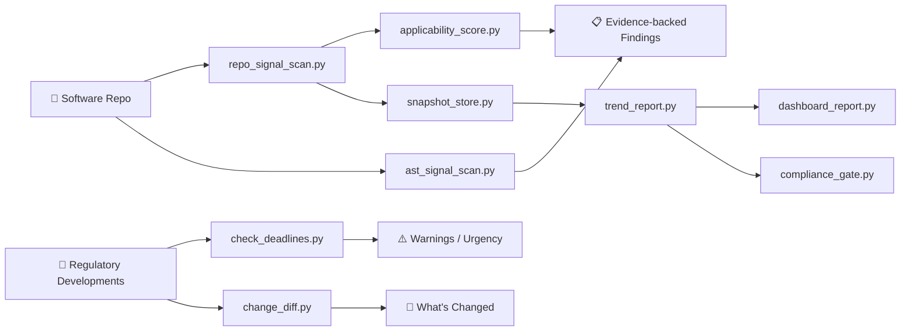

<div align="center">


# Regintel

**Code-aware regulatory intelligence for software repositories.**

Scan any codebase for regulatory signals · Map findings to legal frameworks · Get actionable next steps

[](https://github.com/zerantiq/regintel/actions/workflows/validate.yml)
[](https://www.python.org)
[](LICENSE)
[](https://github.com/zerantiq/regintel)

</div>

---

## 🎯 What Is Regintel?

Regintel is an **AI coding agent skill** that inspects a software repository for likely regulatory issues, maps the findings to legal frameworks, and turns those signals into practical next actions — all from a single prompt.

### Supported Frameworks

<table>
<tr>
<td>🇪🇺 EU AI Act</td>
<td>🤖 ISO/IEC 42001</td>
<td>🔒 GDPR</td>
<td>🇬🇧 UK GDPR</td>
<td>🔐 U.S. State Privacy</td>
<td>🌉 CCPA / CPRA</td>
<td>🇺🇸 Virginia CDPA</td>
<td>🇺🇸 Colorado Privacy Act</td>
</tr>
<tr>
<td>🏥 HIPAA</td>
<td>💊 FDA Software</td>
<td>💳 PCI DSS</td>
<td>📊 SEC Cyber Disclosure</td>
<td>📋 SOX</td>
<td>🏦 DORA</td>
<td>🛡️ NIS2</td>
<td>🤖 NIST AI RMF</td>
</tr>
</table>

### Three Operating Modes

| Mode | Purpose | Output |
|:---|:---|:---|
| **Repo Scan** | Inspect source, config, schemas, infra, and docs | Evidence-backed findings, candidate frameworks, missing controls |
| **Regulatory Update** | Track upcoming regulatory changes and deadlines | Applicability summary, urgency labels, next actions |
| **Continuous Monitoring** | Store snapshots, track trend drift, and enforce gates | Snapshot history, dashboards, policy pass/fail checks |



---

## ⚡ Quick Install

Regintel is designed to be installed once and invoked by prompting your AI agent. **No manual script execution needed.**

For direct CLI usage (v0.8 package):

```bash
python -m pip install zerantiq-regintel
regintel-scan --help
```

Documentation site sources live under [`docs/`](docs/), with MkDocs config in [`mkdocs.yml`](mkdocs.yml).

<details>
<summary><strong>Claude Code</strong> — marketplace plugin</summary>

```bash
claude plugin marketplace add zerantiq/regintel
claude plugin install regintel@zerantiq
```

After restarting Claude Code, the `regintel` skill is active in every repo.
</details>

<details>
<summary><strong>Claude Code</strong> — git clone</summary>

```bash
mkdir -p .agent/skills
git clone https://github.com/zerantiq/regintel .agent/skills/regintel
```

Or add as a submodule:

```bash
git submodule add https://github.com/zerantiq/regintel .agent/skills/regintel
```
</details>

<details>
<summary><strong>Antigravity</strong> — global or per-workspace</summary>

**Global** (available in every workspace):

```bash
git clone https://github.com/zerantiq/regintel ~/.gemini/antigravity/skills/regintel
```

**Per-workspace** (scoped to one project):

```bash
mkdir -p .agents/skills
git clone https://github.com/zerantiq/regintel .agents/skills/regintel
```
</details>

<details>
<summary><strong>OpenAI Codex</strong></summary>

```bash
mkdir -p .agents/skills
git clone https://github.com/zerantiq/regintel .agents/skills/regintel
```

Prompt with the `$regintel` skill prefix, or just ask naturally — the `agents/openai.yaml` manifest enables auto-discovery.
</details>

Then just prompt your agent:

```text
Scan this repo for regulatory compliance issues
```

---

## 💬 Example Prompts

| Prompt | What Happens |
|:---|:---|
| *"Scan this repo for regulatory issues"* | Full scan → applicability scoring → evidence-backed findings |
| *"Does this codebase have GDPR problems?"* | Focused scan with `--focus gdpr` → targeted findings |
| *"What regulatory deadlines should we worry about?"* | Regulatory update mode → deadline urgency labels |
| *"Check this repo for HIPAA issues"* | Focused scan → healthcare-specific signals and controls |
| *"What changed since our last compliance review?"* | Diff mode → snapshot comparison |

---

## 🛠️ Manual Quick Start

> **Prerequisites:** Python 3.10+ · No external dependencies required

```bash
# 1. Validate repo structure
make validate

# 2. Run the regression suite
make test

# 3. Scan a sample repo
python3 scripts/repo_signal_scan.py \
  --path tests/fixtures/repos/ai-saas \
  --scope full > /tmp/scan.json

# 3b. Run the AST structural scanner (Python + TypeScript + Java + Go + .NET/C#)
python3 scripts/ast_signal_scan.py \
  --path tests/fixtures/repos/ai-saas > /tmp/ast.json

# 4. Score framework relevance
python3 scripts/applicability_score.py \
  --signals /tmp/scan.json \
  --company examples/company-context.json \
  --format markdown

# 5. Check deadline urgency
python3 scripts/check_deadlines.py \
  --input examples/developments.json \
  --format markdown

# 6. Compare two snapshots
python3 scripts/change_diff.py \
  --old examples/old-scan.json \
  --new examples/new-scan.json \
  --format markdown

# 7. Sync external regulatory feeds (JSON/RSS/Atom)
python3 scripts/sync_regulatory_feeds.py \
  --config examples/regulatory-feed-config.json \
  --format json > /tmp/synced-developments.json

# 8. Store a monitoring snapshot
python3 scripts/snapshot_store.py \
  --scan /tmp/scan.json \
  --applicability /tmp/regintel-applicability.json \
  --deadlines /tmp/deadlines.json \
  --ast /tmp/ast.json \
  --snapshot-dir .regintel/snapshots

# 9. Build a trend report
python3 scripts/trend_report.py \
  --snapshot-dir .regintel/snapshots \
  --format markdown

# 10. Render a dashboard
python3 scripts/dashboard_report.py \
  --snapshot-dir .regintel/snapshots \
  --format html \
  --output /tmp/regintel-dashboard.html

# 11. Evaluate policy gates for CI
python3 scripts/compliance_gate.py \
  --policy examples/compliance-gate-policy.json \
  --scan /tmp/scan.json \
  --deadlines /tmp/deadlines.json \
  --ast /tmp/ast.json \
  --format markdown
```

---

## 📦 Scripts

| Script | Purpose |
|:---|:---|
| [`repo_signal_scan.py`](scripts/repo_signal_scan.py) | Scan a repo and inventory evidence-backed regulatory signals |
| [`ast_signal_scan.py`](scripts/ast_signal_scan.py) | Multi-language structural scan (Python AST + TypeScript/Java/Go/.NET-C# function-block analysis) for function-level patterns |
| [`applicability_score.py`](scripts/applicability_score.py) | Score framework relevance from scan output + optional company context |
| [`check_deadlines.py`](scripts/check_deadlines.py) | Label milestone urgency for regulatory developments |
| [`change_diff.py`](scripts/change_diff.py) | Compare old and new regulatory or scan snapshots |
| [`snapshot_store.py`](scripts/snapshot_store.py) | Persist timestamped monitoring snapshots and baseline deltas |
| [`trend_report.py`](scripts/trend_report.py) | Summarize trend movement across snapshots |
| [`dashboard_report.py`](scripts/dashboard_report.py) | Render monitoring dashboards in Markdown or HTML |
| [`sync_regulatory_feeds.py`](scripts/sync_regulatory_feeds.py) | Sync JSON/RSS/Atom feeds into `developments` schema |
| [`compliance_gate.py`](scripts/compliance_gate.py) | Evaluate policy-based compliance gates for CI and release checks |
| [`validate_repo.py`](tools/validate_repo.py) | Validate repo structure, frontmatter, and Python syntax |

---

## 🧪 Testing

The test suite covers framework detection, multi-language structural findings, diff-scan behavior, deadline labels, evidence-class tracking, false-positive suppression, and more.

```bash
make check   # validate + test in one step
```

**Fixture repos** used for regression testing:

| Fixture | Archetype | Key Frameworks |
|:---|:---|:---|
| `ai-saas` | AI/ML SaaS platform | EU AI Act, GDPR, US State Privacy |
| `healthcare` | Clinical application | HIPAA, FDA Software |
| `fintech` | Financial services | SOX, DORA, SEC Cyber |
| `iot` | IoT infrastructure | NIS2, NIST AI RMF |
| `polyglot-regulated` | Polyglot platform + IaC | ISO 42001, UK GDPR, CCPA/CPRA, PCI DSS |
| `polyglot-structural` | Structural-scan stress fixture | TypeScript, Java, Go, .NET/C# function-level findings |
| `low-risk` | Minimal signals | *(negative test case)* |

---

## 📁 Repository Layout

```text
.
├── conductor.json            # Claude Code marketplace manifest
├── .claude-plugin/
│   └── plugin.json           # Plugin metadata
├── agents/
│   └── openai.yaml           # OpenAI Codex agent manifest
├── skills/regintel/
│   └── SKILL.md              # Skill definition (installed copy)
├── scripts/                  # Core analysis scripts
├── references/               # Domain knowledge & schemas
├── examples/                 # Sample inputs & scan reports
├── tests/                    # Regression suite & fixtures
├── tools/                    # Repo validation tooling
├── .github/                  # CI workflows & issue templates
├── SKILL.md                  # Canonical skill source
├── CLAUDE.md                 # Agent development guide
├── ROADMAP.md                # Planned milestones
├── CONTRIBUTING.md
├── SECURITY.md
├── CODE_OF_CONDUCT.md
└── LICENSE
```

---

## 🔍 How It Works

1. **Signal detection** — `repo_signal_scan.py` walks your repo's source, config, schemas, and docs, matching patterns against 28 signal definitions with evidence-class weighting (source/config evidence ranked higher than docs/comments). Python docstrings are excluded to suppress false positives from regulatory terms mentioned only in documentation prose.

2. **Structural analysis** — `ast_signal_scan.py` parses Python source files using stdlib `ast` and applies function-block structural analysis for TypeScript, Java, Go, and .NET/C# to detect: PII fields in return values, database writes without audit logging, and storage writes without encryption indicators.

3. **Framework mapping** — Detected signals are mapped to 16 regulatory frameworks through 11 control rules. Each framework receives a weighted score based on the strength and class of evidence found.

4. **Applicability scoring** — `applicability_score.py` combines scan output with optional company context (jurisdiction, industry, data types) to produce prioritized framework recommendations.

5. **Deadline tracking** — `check_deadlines.py` labels regulatory milestones with urgency levels: *Critical Deadline*, *Action Needed Soon*, *Upcoming Change*, or *Monitor*.

6. **Continuous monitoring** — `snapshot_store.py` and `trend_report.py` track changes over time, while `dashboard_report.py` renders lightweight status dashboards for recent scan history.

7. **Policy gating** — `compliance_gate.py` applies configurable thresholds to signals, controls, deadlines, structural findings, and trend movement so CI can fail on unacceptable risk drift.

---

## 🗺️ Roadmap

See **[ROADMAP.md](ROADMAP.md)** for the planned evolution of Regintel:

| Version | Focus |
|:---|:---|
| **v0.1** | ✅ Initial release — core scanner, 7 frameworks, agent integrations |
| **v0.2** | ✅ Stronger heuristics, DORA/NIS2/NIST AI RMF, evidence-class weighting |
| **v0.3** | ✅ AST-based structural scanning — function-level PII, DB write, and storage findings |
| **v0.4** | ✅ Extended framework + jurisdiction support (ISO 42001, UK GDPR, CCPA/CPRA, PCI DSS, polyglot + IaC scanning) |
| **v0.5** | ✅ Continuous monitoring, scheduled CI scans, dashboards, and feed sync |
| **v0.6** | ✅ Policy-based compliance gates and CI quality enforcement |
| **v0.7** | ✅ Stable interfaces, pip entry points, and docs site |
| **v0.8** | ✅ Multi-language structural scanning across Python, TypeScript, Java, Go, and .NET/C# |
| **v0.9** | Planned: incremental cache + parallel scanning for large repos |
| **v1.0** | Planned: benchmark harness with precision/recall CI tracking |

---

## 🤝 Contributing

We welcome contributions! Start with **[CONTRIBUTING.md](CONTRIBUTING.md)**. High-impact areas:

- 🎯 Better scan heuristics with fewer false positives
- 📐 Clearer applicability logic for edge cases
- 📚 Stronger reference material for regulatory obligations
- ✅ Tighter test coverage for the analysis scripts

---

## 🔒 Security

For security-sensitive findings, follow **[SECURITY.md](SECURITY.md)** instead of opening a public issue.

---

<div align="center">

**[Documentation](docs/index.md)** · **[Roadmap](ROADMAP.md)** · **[Contributing](CONTRIBUTING.md)** · **[Security](SECURITY.md)**

MIT License · Copyright © 2026 [Zerantiq](https://www.zerantiq.com)

</div>
