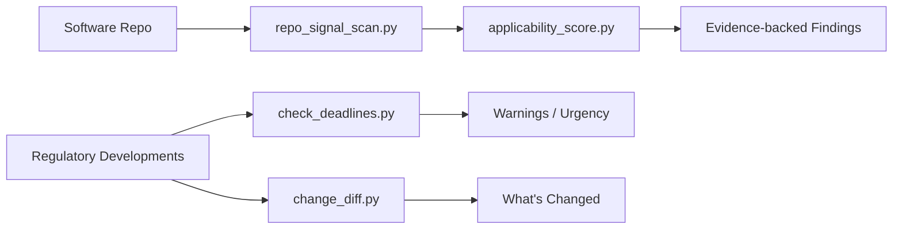

# Regintel

> Code-aware regulatory intelligence for software repositories.

Regintel helps teams inspect a software repo for likely regulatory issues, map the findings to frameworks such as the EU AI Act, GDPR, HIPAA, FDA software obligations, SEC cyber disclosure, and SOX, and turn those signals into practical next actions.

## Why This Repo Exists

This repository packages `regintel` as a Codex skill with:

- a repo scan workflow for software codebases
- a regulatory update workflow for current developments and deadlines
- bundled references for applicability and warning logic
- Python helpers for signal detection, applicability scoring, deadline checks, and change diffs

## What Regintel Does

| Mode | Purpose | Core Output |
|---|---|---|
| Repo scan | Inspect source, config, schemas, infra, and docs for likely compliance signals | Evidence-backed findings, candidate frameworks, missing-control observations |
| Regulatory update | Track current or upcoming regulatory changes | Applicability summary, warnings, next actions, deadline urgency |



## Repository Layout

```text
.
├── SKILL.md
├── CLAUDE.md
├── agents/
├── references/
├── scripts/
├── tools/
├── .github/
├── CONTRIBUTING.md
├── SECURITY.md
├── CODE_OF_CONDUCT.md
├── LICENSE
└── README.md
```

## Quick Start

### 1. Validate the repo

```bash
make validate
```

### 2. Run a repo scan

```bash
python3 scripts/repo_signal_scan.py --path . --scope full > /tmp/regintel-scan.json
python3 scripts/applicability_score.py --signals /tmp/regintel-scan.json --format markdown
```

### 3. Check milestone urgency

```bash
python3 scripts/check_deadlines.py --input developments.json --format markdown
```

### 4. Compare two snapshots

```bash
python3 scripts/change_diff.py --old old.json --new new.json --format markdown
```

## Clean Examination Workflow

Use this sequence when reviewing the repo:

1. Read [README.md](README.md) and [SKILL.md](SKILL.md).
2. Read [CLAUDE.md](CLAUDE.md) if you are using an AI coding agent to work in the repo.
3. Review the domain references in [references/frameworks.md](references/frameworks.md) and [references/repo-scan-signals.md](references/repo-scan-signals.md).
4. Run `make validate` to verify structure and script health.
5. Run `repo_signal_scan.py` against a target repo or this repo itself.
6. Use `applicability_score.py` to turn raw signals into framework-specific review priorities.

## Script Overview

| Script | Purpose |
|---|---|
| `scripts/repo_signal_scan.py` | Scans a repo and inventories evidence-backed regulatory signals |
| `scripts/applicability_score.py` | Scores likely framework relevance from scan output and optional company context |
| `scripts/check_deadlines.py` | Labels milestone urgency for regulatory developments |
| `scripts/change_diff.py` | Compares old and new regulatory or scan snapshots |
| `tools/validate_repo.py` | Repo-native validation for structure, frontmatter, and Python syntax |

## Contributing

Start with [CONTRIBUTING.md](CONTRIBUTING.md). Good contributions usually include one or more of:

- better repo-scan heuristics with reduced false positives
- clearer applicability logic for framework-specific edge cases
- stronger reference material for software and AI obligations
- tighter test and validation coverage for the helper scripts

## Reporting Bugs

Use the GitHub bug report template for normal issues. For security-sensitive findings, follow [SECURITY.md](SECURITY.md) instead of opening a public issue with exploit details.

## License

This repository is licensed under the MIT License. See [LICENSE](LICENSE).
