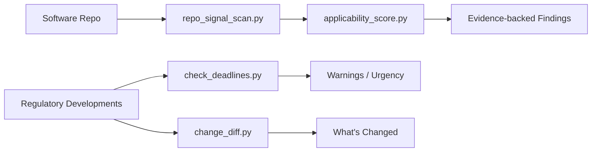

# Regintel

> Code-aware regulatory intelligence for software repositories.

Regintel helps teams inspect a software repo for likely regulatory issues, map the findings to frameworks such as the EU AI Act, GDPR, HIPAA, FDA software obligations, SEC cyber disclosure, and SOX, and turn those signals into practical next actions.

## Install as a Claude Code Skill

Anyone can install regintel as a Claude Code plugin in two commands:

```bash
claude plugin marketplace add zerantiq/regintel
claude plugin install regintel@zerantiq
```

After restarting Claude Code, the `regintel` skill is active in every repo. Ask Claude things like:

- *"Scan this repo for regulatory compliance"*
- *"Does this codebase raise GDPR issues?"*
- *"What are the upcoming EU AI Act deadlines?"*
- *"Check this repo for HIPAA problems"*

Claude will automatically invoke the skill and run the full analysis pipeline.

## Install as an Antigravity Skill

Antigravity discovers skills from `SKILL.md` files. Install globally or per-workspace:

**Global** (available in every workspace):

```bash
git clone https://github.com/zerantiq/regintel ~/.gemini/antigravity/skills/regintel
```

**Per-workspace** (scoped to one project):

```bash
mkdir -p .agents/skills
git clone https://github.com/zerantiq/regintel .agents/skills/regintel
```

After opening the workspace in Antigravity, the `regintel` skill is active. Ask things like:

- *"Scan this repo for regulatory compliance"*
- *"Does this codebase raise GDPR issues?"*
- *"What are the upcoming EU AI Act deadlines?"*
- *"Check this repo for HIPAA problems"*

Antigravity will automatically read the skill, run the Python scripts, review the code, and deliver a full audit report.

## Why This Repo Exists

This repository packages `regintel` as an AI coding agent skill (Claude Code, Antigravity, OpenAI Codex, and compatible agents) with:

- a repo scan workflow for software codebases
- a regulatory update workflow for current developments and deadlines
- bundled references for applicability and warning logic
- Python helpers for signal detection, applicability scoring, deadline checks, and change diffs

## What Regintel Does

| Mode | Purpose | Core Output |
|---|---|---|
| Repo scan | Inspect source, config, schemas, infra, and docs for likely compliance signals | Evidence-backed findings, candidate frameworks, missing-control observations |
| Regulatory update | Track current or upcoming regulatory changes | Applicability summary, warnings, next actions, deadline urgency |



## Install as a Skill

Regintel is designed to be installed once and then invoked by prompting your AI agent. No manual script execution needed.

### Claude Code

Clone into your project's `.agent/skills/` directory:

```bash
mkdir -p .agent/skills
git clone https://github.com/zerantiq/regintel .agent/skills/regintel
```

Or add as a git submodule:

```bash
git submodule add https://github.com/zerantiq/regintel .agent/skills/regintel
```

Then prompt Claude Code:

```
Make a regulatory compliance check on this repo
```

Claude will automatically read the skill, run the Python scripts, review the code, and deliver a full audit report.

### Antigravity

Antigravity loads skills from `SKILL.md` files in two locations:

**Global** (every workspace):

```bash
git clone https://github.com/zerantiq/regintel ~/.gemini/antigravity/skills/regintel
```

**Per-workspace** (one project):

```bash
mkdir -p .agents/skills
git clone https://github.com/zerantiq/regintel .agents/skills/regintel
```

Or add as a git submodule:

```bash
git submodule add https://github.com/zerantiq/regintel .agents/skills/regintel
```

Then prompt Antigravity:

```
Scan this repo for regulatory compliance issues
```

Antigravity will automatically discover the skill, run the Python scripts, review the code, and deliver a full audit report.

### OpenAI Codex

Clone the repo alongside your project:

```bash
git clone https://github.com/zerantiq/regintel
```

Or install into a skills directory if your Codex setup supports it:

```bash
mkdir -p .agents/skills
git clone https://github.com/zerantiq/regintel .agents/skills/regintel
```

Then prompt Codex using the `$regintel` skill prefix:

```
Use $regintel to scan this software repo for likely regulatory issues
```

Codex will invoke the skill, run the analysis pipeline, and produce an evidence-backed report. You can also prompt without the prefix:

```
Scan this repo for regulatory compliance
```

The `agents/openai.yaml` manifest enables Codex to discover and invoke the skill automatically when the prompt matches.

### Example Prompts

| Prompt | What Happens |
|---|---|
| *"Scan this repo for regulatory issues"* | Full scan → applicability scoring → evidence-backed findings |
| *"Does this codebase have GDPR problems?"* | Focused scan with `--focus gdpr` → targeted findings |
| *"What regulatory deadlines should we worry about?"* | Regulatory update mode → deadline urgency labels |
| *"Check this repo for HIPAA issues"* | Focused scan → healthcare-specific signals and controls |
| *"What changed since our last compliance review?"* | Diff mode → snapshot comparison |

## Repository Layout

```text
.
├── conductor.json          # Claude Code marketplace manifest
├── .claude-plugin/
│   └── plugin.json         # Plugin metadata
├── skills/
│   └── regintel/
│       └── SKILL.md        # Skill definition (installed copy)
├── SKILL.md                # Canonical skill source
├── CLAUDE.md
├── agents/
├── examples/
├── references/
├── scripts/
├── tests/
├── tools/
├── .github/
├── CONTRIBUTING.md
├── SECURITY.md
├── CODE_OF_CONDUCT.md
├── LICENSE
└── README.md
```

## Quick Start

### 1. Validate the repo

```bash
make validate
```

### 2. Run the regression suite

```bash
make test
```

### 3. Run a repo scan on the sample AI SaaS fixture

```bash
python3 scripts/repo_signal_scan.py --path tests/fixtures/repos/ai-saas --scope full > /tmp/regintel-scan.json
python3 scripts/applicability_score.py --signals /tmp/regintel-scan.json --company examples/company-context.json --format markdown
```

### 4. Check milestone urgency

```bash
python3 scripts/check_deadlines.py --input examples/developments.json --format markdown
```

### 5. Compare two snapshots

```bash
python3 scripts/change_diff.py --old examples/old-scan.json --new examples/new-scan.json --format markdown
```

## Clean Examination Workflow

Use this sequence when reviewing the repo:

1. Read [README.md](README.md) and [SKILL.md](SKILL.md).
2. Read [CLAUDE.md](CLAUDE.md) if you are using an AI coding agent to work in the repo.
3. Review the domain references in [references/frameworks.md](references/frameworks.md) and [references/repo-scan-signals.md](references/repo-scan-signals.md).
4. Run `make check` to verify structure and regression behavior.
5. Run `repo_signal_scan.py` against a target repo or this repo itself.
6. Use `applicability_score.py` to turn raw signals into framework-specific review priorities.
7. Use `examples/` when you want deterministic deadline and diff demonstrations.

## Script Overview

| Script | Purpose |
|---|---|
| `scripts/repo_signal_scan.py` | Scans a repo and inventories evidence-backed regulatory signals |
| `scripts/applicability_score.py` | Scores likely framework relevance from scan output and optional company context |
| `scripts/check_deadlines.py` | Labels milestone urgency for regulatory developments |
| `scripts/change_diff.py` | Compares old and new regulatory or scan snapshots |
| `tools/validate_repo.py` | Repo-native validation for structure, frontmatter, and Python syntax |

## Examples and Tests

- `examples/` contains ready-to-run JSON inputs for deadline checks, applicability scoring, and snapshot diffs.
- `tests/fixtures/repos/` contains three regression fixture repos:
  - `ai-saas`
  - `healthcare`
  - `low-risk`
- `tests/test_regintel.py` asserts expected framework detection, diff-scan behavior, deadline labels, and example diff output.

## Contributing

Start with [CONTRIBUTING.md](CONTRIBUTING.md). Good contributions usually include one or more of:

- better repo-scan heuristics with reduced false positives
- clearer applicability logic for framework-specific edge cases
- stronger reference material for software and AI obligations
- tighter test and validation coverage for the helper scripts

## Reporting Bugs

Use the GitHub bug report template for normal issues. For security-sensitive findings, follow [SECURITY.md](SECURITY.md) instead of opening a public issue with exploit details.

## License

This repository is licensed under the MIT License. See [LICENSE](LICENSE).
